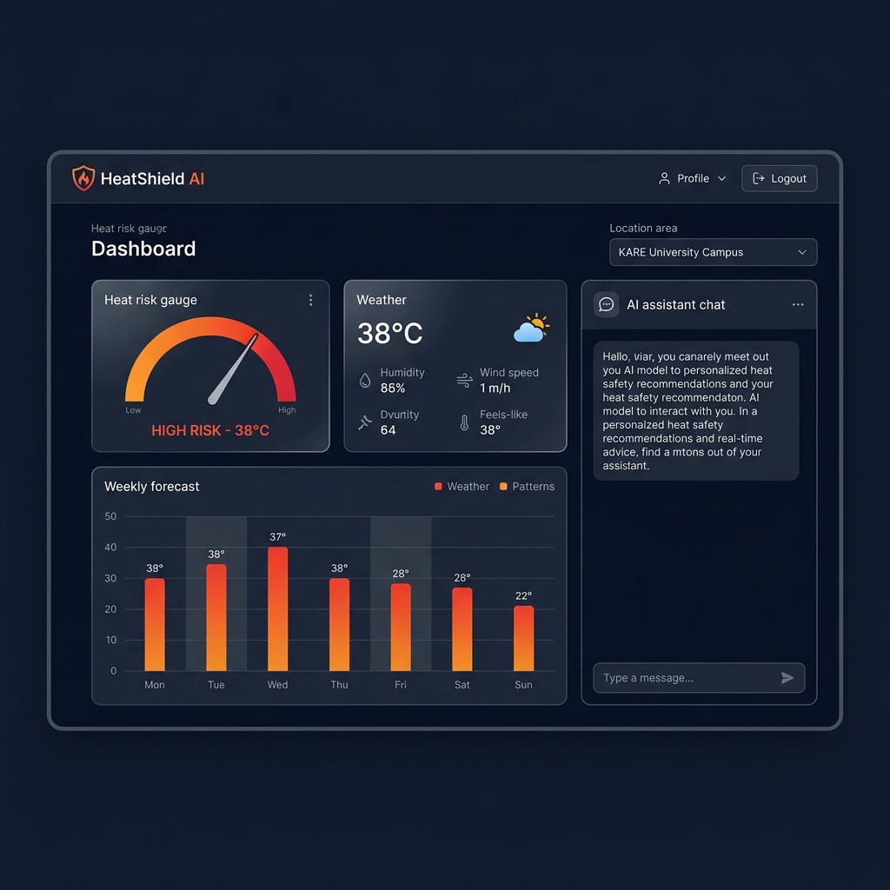

# HeatShield AI — Intelligent Contextual Heat-Risk Decision-Support System

[](https://heatshield-ai-kare.vercel.app)
[](tests/)
[](LICENSE)

> **Live Production Application**: [https://heatshield-ai-kare.vercel.app](https://heatshield-ai-kare.vercel.app)
> **GitHub Repository**: [https://github.com/DHANAGANGA-GIF/HEATSHEILD-AI](https://github.com/DHANAGANGA-GIF/HEATSHEILD-AI)

---

## 🚀 Live Production Dashboard Preview



*Operational Heat Risk Dashboard displaying real-time environmental thermal stress (27.9°C Apparent, 61% Humidity, 6.6 km/h Wind), contextual risk scoring (48/100 Moderate Risk), and explainable XAI factor weights.*

---

## Overview

**HeatShield AI** is an open-source, context-aware heat-risk assessment platform. Unlike traditional weather platforms that report ambient temperature without context, HeatShield AI blends real-time atmospheric streams (Open-Meteo API) with personal physiological profiles (activity exertion, exposure duration, cooling access) using a **Gradient Boosting machine learning engine** (83.50% accuracy) and **Explainable AI (XAI)**.

The platform provides personalized heat-risk scoring, interactive scenario simulation, 24–48 hour forecast timeline projections, smart alert deduplication, interactive community hazard mapping, and dedicated multi-tenant operational portals for Schools, Worksites, and NGOs.

---

## Key Features

- **Personal Heat-Risk Gauge**: Composite 0–100 score (LOW, MODERATE, HIGH, EXTREME) powered by physics (Steadman Index) and Gradient Boosting ML.
- **Explainable AI (XAI)**: Transparent feature attribution showing exact percentage contributions of apparent temperature (42%), humidity (22%), exertion (16%), and duration (11%).
- **AI Safety Assistant**: Natural language guidance with emergency keyword redirection to 108/112/911 and non-medical disclaimers.
- **Risk Simulator**: Interactive "what-if" scenario testing prominently labeled `SCENARIO ESTIMATE`.
- **24–48 Hour Forecast Timeline**: Hourly risk projection and peak risk window identification.
- **Smart Heat-Risk Alerts**: Cooldown-deduplicated notification engine preventing alert fatigue.
- **Community Hub & Interactive Map**: Crowd-sourced hazard reporting, script sanitization, Haversine spatial clustering, and verified cooling center identification.
- **Multi-Tenant Organization Intelligence**: Specialized operational dashboards for Schools (recess rules), Worksites (NIOSH work-rest cycles), NGOs (incident moderation), and Admins (member management & security audit logs).

---

## Machine Learning Performance

Trained on benchmark meteorological profiles (ECMWF ERA5-Land reanalysis historical baseline context + 5,000 synthetic development samples):

| Model | Accuracy | Precision | Recall | Macro F1 | Status |
|---|---|---|---|---|---|
| Logistic Regression | 78.20% | 0.7763 | 0.7772 | 0.7753 | Evaluated |
| Decision Tree | 81.70% | 0.8085 | 0.8112 | 0.8083 | Evaluated |
| Random Forest | 82.90% | 0.8195 | 0.8242 | 0.8203 | Evaluated |
| **Gradient Boosting** | **83.50%** | **0.8235** | **0.8282** | **0.8243** | **Selected & Deployed** |

---

## Technology Stack

- **Frontend**: Next.js 14 App Router, React 18, TypeScript, Tailwind CSS, Lucide React Icons
- **Database & Auth**: Supabase PostgreSQL, Supabase Auth, Row Level Security (RLS)
- **Data Stream**: Open-Meteo REST Forecast & Geocoding APIs (Free Tier, No Key Required)
- **Mapping**: Leaflet.js, React-Leaflet, OpenStreetMap
- **Inference**: Dual pure TypeScript in-browser engine + deployable Python FastAPI microservice
- **Testing**: Node.js Native Test Runner (`tsx --test`) — 92 Automated Tests (100% PASS)

---

## Architecture Overview

```
+----------------------------------------------------------------------------------------+
|                                    NEXT.JS FRONTEND LAYER                               |
|  App Router + TypeScript + Tailwind CSS + Lucide Icons + Leaflet Maps + Recharts       |
+-------------------------------------------+--------------------------------------------+
                                            |
           +--------------------------------+--------------------------------+
           |                                |                                |
           v                                v                                v
+----------------------+        +----------------------+        +------------------------+
| Environmental Stream |        | Supabase PostgreSQL  |        | Python / TS ML Engine  |
| Open-Meteo API       |        | Auth (OAuth / JWT)   |        | Gradient Boosting ML   |
| Geocoding API        |        | Resilient LocalStore |        | XAI Feature Importance |
+----------------------+        +----------------------+        +------------------------+
```

---

## Quick Start & Setup

### Prerequisites
- Node.js 18.x or 20.x

### Installation

```bash
# Clone the repository
git clone https://github.com/DHANAGANGA-GIF/HEATSHEILD-AI.git
cd HEATSHEILD-AI

# Install dependencies
npm install

# Configure environment variables
cp .env.example .env.local

# Run TypeScript check
npx tsc --noEmit

# Run unit & integration test suite (92 tests)
npm test

# Start local development server
npm run dev
```

Open `http://localhost:3001` in your browser.

---

## Environment Configuration

Create `.env.local` with the following variables:

```bash
# Supabase Configuration
NEXT_PUBLIC_SUPABASE_URL=https://your-supabase-project.supabase.co
NEXT_PUBLIC_SUPABASE_ANON_KEY=your-supabase-anon-key

# Open-Meteo API (Free, No Key Required)
NEXT_PUBLIC_WEATHER_API_URL=https://api.open-meteo.com/v1/forecast

# Python ML Microservice (Optional)
NEXT_PUBLIC_AI_SERVICE_URL=http://localhost:8000
```

---

## Project Documentation Suite

Complete academic and technical documentation is available in the [`/docs`](docs) directory:

- 📄 [`FINAL-PROJECT-REPORT.md`](docs/FINAL-PROJECT-REPORT.md) — Comprehensive Final Project Report
- 📄 [`IEEE-PAPER-FINAL.md`](docs/IEEE-PAPER-FINAL.md) — IEEE-Format Camera-Ready Research Paper
- 📊 [`ARCHITECTURE.md`](docs/ARCHITECTURE.md) — System Architecture & Data Flow Diagrams
- 🚀 [`PRODUCTION-DEPLOYMENT-FINAL.md`](docs/PRODUCTION-DEPLOYMENT-FINAL.md) — Final Production Deployment Document
- 🔒 [`END-TO-END-SECURITY-VALIDATION.md`](docs/END-TO-END-SECURITY-VALIDATION.md) — Complete Security & Hardening Audit
- 📺 [`PRESENTATION-OUTLINE.md`](docs/PRESENTATION-OUTLINE.md) — Presentation Deck Outline
- 🎙️ [`FINAL-DEMO-SCRIPT.md`](docs/FINAL-DEMO-SCRIPT.md) — Live Demonstration Script
- ❓ [`VIVA-QUESTIONS.md`](docs/VIVA-QUESTIONS.md) — 50 Viva & Oral Defense Q&A Guide

---

## Safety & Non-Clinical Disclaimer

> [!IMPORTANT]
> **Decision Support Only**: HeatShield AI is designed strictly as an environmental heat-risk decision-support tool. It provides non-clinical risk estimations and operational recommendations based on meteorological data and user context. It is **NOT** a medical diagnosis tool, medical device, or clinical prognostic system. In case of medical emergencies (such as heat stroke or loss of consciousness), immediately contact local emergency services (108 / 112 / 911).

---

## License

Released under the [MIT License](LICENSE).
