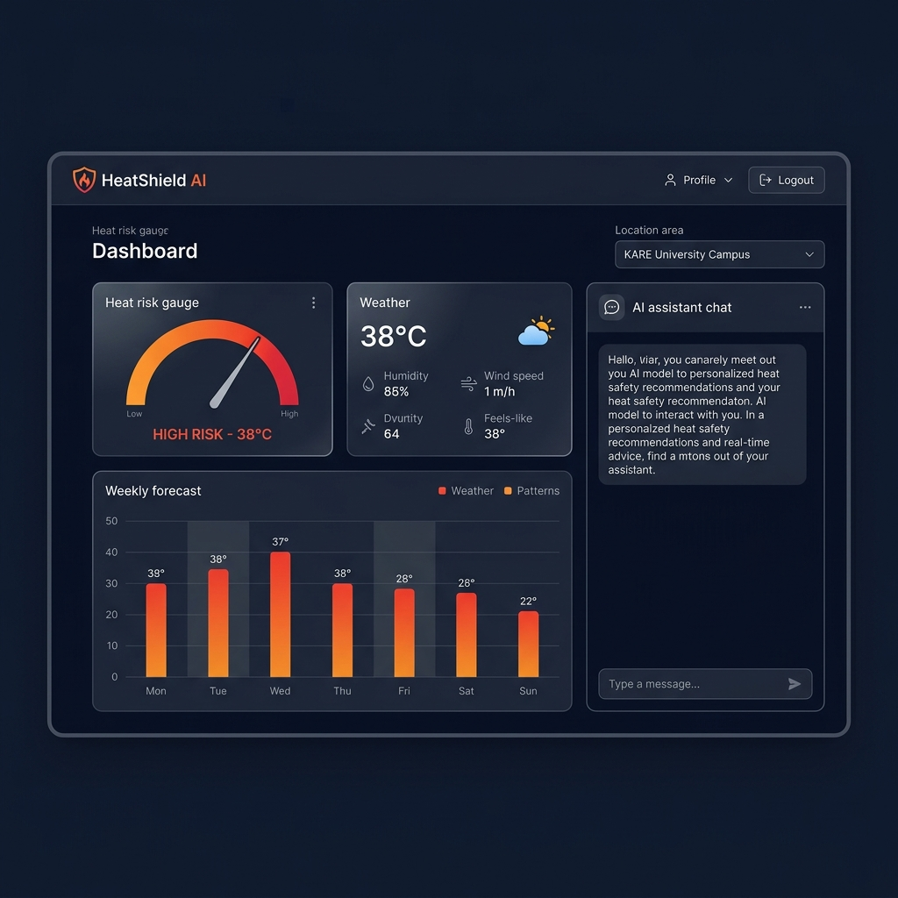

# HeatShield AI — AI-Based Heat Risk Awareness and Preventive Guidance System

[](https://heatshield-ai-kare.vercel.app)
[](tests/)
[](LICENSE)

> **Live Production Application**: [https://heatshield-ai-kare.vercel.app](https://heatshield-ai-kare.vercel.app)  
> **GitHub Repository**: [https://github.com/DHANAGANGA-GIF/HEATSHEILD-AI](https://github.com/DHANAGANGA-GIF/HEATSHEILD-AI)

---

## 🚀 Live Production Dashboard Preview



*Operational Heat Risk Dashboard displaying real-time environmental thermal stress, contextual risk scoring (0–100 Index), explainable risk factor breakdown, and personalized preventive guidance.*

---

## Overview

**HeatShield AI** is an open-source, context-aware heat-risk awareness and decision-support platform. Unlike traditional weather apps that report raw temperature, HeatShield AI blends real-time atmospheric observations (Open-Meteo API) with user physiological context (activity level, exposure duration, cooling access, age group) using a **Rule-Based Heat Risk Engine** grounded in atmospheric Steadman Heat Index equations.

The platform provides personalized heat-risk scoring (0–100), transparent risk explanations (Explainable AI / XAI factor breakdown), interactive scenario simulation, 24–48 hour forecast timeline projections, smart alert deduplication, email advisory dispatch, and dedicated portals for Schools, Worksites, and NGOs.

> **Scope Clarification**: The active production runtime uses a deterministic rule-based engine for transparent, reproducible calculations. Machine Learning models (Gradient Boosting, Random Forest, Logistic Regression, Decision Tree) have been trained and evaluated offline on benchmark datasets as part of the academic research future scope — they are **not** running in the production application.

---

## Key Features

- **Personal Heat-Risk Gauge**: Composite 0–100 score (LOW / MODERATE / HIGH / EXTREME) computed via Steadman Heat Index equations with contextual physiological multipliers.
- **Explainable AI (XAI)**: Transparent factor attribution showing percentage contributions of apparent temperature, relative humidity, physical exertion, and exposure duration to the final score.
- **AI Safety Assistant**: Natural language guidance chatbot with emergency keyword redirection to 108/112 and strict non-clinical disclaimers.
- **What-If Risk Simulator**: Interactive scenario testing prominently labeled `SCENARIO ESTIMATE` — never presented as live conditions.
- **24–48 Hour Forecast Timeline**: Hourly risk projection and peak heat-window identification using Open-Meteo forecast data.
- **Email Advisory Dispatch**: Working transactional email (Gmail OAuth 2.0) delivering point-in-time heat-risk summaries to the verified user's inbox only.
- **Community Hub**: Crowd-sourced hazard reporting with HTML sanitization, Haversine spatial clustering, and Supabase RLS data isolation.
- **Multi-Tenant Organization Portals**: Specialized dashboards for Schools (recess scheduling rules), Worksites (NIOSH work-rest cycles), NGOs (incident moderation), and Admins.
- **Multilingual Interface**: English, Telugu (తెలుగు), Tamil (தமிழ்), and Hindi (हिन्दी).

---

## Machine Learning — Offline Research Component

As part of the academic scope of this project, machine learning models were trained and evaluated offline using benchmark meteorological data (5,000 synthetic development samples based on ECMWF ERA5-Land reanalysis climatological parameters).

| Model | Accuracy | Precision | Recall | Macro F1 | ROC-AUC | Status |
|---|---|---|---|---|---|---|
| Logistic Regression | 91.6% | 0.9184 | 0.9173 | 0.9178 | 0.9915 | Evaluated Offline |
| Decision Tree | 81.4% | 0.8180 | 0.8106 | 0.8134 | 0.9528 | Evaluated Offline |
| Random Forest | 84.7% | 0.8499 | 0.8426 | 0.8459 | 0.9732 | Evaluated Offline |
| **Gradient Boosting** | **89.6%** | **0.8966** | **0.8990** | **0.8976** | **0.9858** | **Best Offline Result** |

> These results were obtained from offline evaluation only. The production application currently uses the Rule-Based Heat Risk Engine. Integrating a validated ML model into production is a declared future scope item pending clinical and data-quality validation.

---

## Technology Stack

- **Frontend**: Next.js 14 App Router, React 18, TypeScript, Tailwind CSS, Lucide React Icons
- **Database & Auth**: Firebase (primary auth) + Supabase PostgreSQL, Row Level Security (RLS)
- **Data Stream**: Open-Meteo REST Forecast & Geocoding APIs (Free Tier, No API Key Required)
- **Email**: Gmail OAuth 2.0 transactional delivery (Resend fallback)
- **Risk Engine**: Pure TypeScript rule-based heat risk engine (Steadman Heat Index + contextual multipliers)
- **Offline ML Research**: Python scikit-learn (Gradient Boosting, Random Forest, Logistic Regression — evaluated separately)
- **Testing**: Node.js Native Test Runner (`tsx --test`) — automated integration and unit tests

---

## Architecture Overview

```
+----------------------------------------------------------------------------------------+
|                                    NEXT.JS FRONTEND LAYER                              |
|  App Router + TypeScript + Tailwind CSS + Lucide Icons + Recharts Charts              |
+-------------------------------------------+--------------------------------------------+
                                            |
           +--------------------------------+--------------------------------+
           |                                |                                |
           v                                v                                v
+----------------------+        +----------------------+        +------------------------+
| Environmental Stream |        | Firebase + Supabase  |        | Rule-Based Risk Engine |
| Open-Meteo API       |        | Auth (OAuth / JWT)   |        | Steadman Heat Index    |
| Geocoding API        |        | PostgreSQL + RLS     |        | XAI Factor Breakdown   |
+----------------------+        +----------------------+        +------------------------+
```

---

## Quick Start & Setup

### Prerequisites
- Node.js 18.x or 20.x

### Installation

```bash
# Clone the repository
git clone https://github.com/DHANAGANGA-GIF/HEATSHEILD-AI.git
cd HEATSHEILD-AI

# Install dependencies
npm install

# Configure environment variables
cp .env.example .env.local

# Run TypeScript check
npx tsc --noEmit

# Run automated test suite
npm test

# Start local development server
npm run dev
```

Open `http://localhost:3001` in your browser.

---

## Environment Configuration

Create `.env.local` with the following variables (see `.env.example` for complete reference):

```bash
# Firebase Configuration
NEXT_PUBLIC_FIREBASE_API_KEY=your-firebase-api-key
NEXT_PUBLIC_FIREBASE_PROJECT_ID=your-project-id

# Supabase Configuration
NEXT_PUBLIC_SUPABASE_URL=https://your-supabase-project.supabase.co
NEXT_PUBLIC_SUPABASE_ANON_KEY=your-supabase-anon-key

# Open-Meteo API (Free, No Key Required)
NEXT_PUBLIC_WEATHER_API_URL=https://api.open-meteo.com/v1/forecast
```

---

## Project Documentation Suite

Complete academic and technical documentation is available in the [`/docs`](docs) directory:

- 📄 [`FINAL-PROJECT-REPORT.md`](docs/FINAL-PROJECT-REPORT.md) — Comprehensive Final Project Report
- 📄 [`IEEE-PAPER-FINAL.md`](docs/IEEE-PAPER-FINAL.md) — IEEE-Format Camera-Ready Research Paper
- 📊 [`ARCHITECTURE.md`](docs/ARCHITECTURE.md) — System Architecture & Data Flow Diagrams
- 🚀 [`PRODUCTION-DEPLOYMENT-FINAL.md`](docs/PRODUCTION-DEPLOYMENT-FINAL.md) — Final Production Deployment Document
- 🔒 [`END-TO-END-SECURITY-VALIDATION.md`](docs/END-TO-END-SECURITY-VALIDATION.md) — Complete Security & Hardening Audit
- 📺 [`PRESENTATION-OUTLINE.md`](docs/PRESENTATION-OUTLINE.md) — Presentation Deck Outline
- 🎙️ [`FINAL-DEMO-SCRIPT.md`](docs/FINAL-DEMO-SCRIPT.md) — Live Demonstration Script
- ❓ [`VIVA-QUESTIONS.md`](docs/VIVA-QUESTIONS.md) — 50 Viva & Oral Defense Q&A Guide

---

## Safety & Non-Clinical Disclaimer

> [!IMPORTANT]
> **Decision Support Only**: HeatShield AI is designed strictly as an environmental heat-risk decision-support tool. It provides non-clinical risk estimations and operational recommendations based on meteorological data and user context. It is **NOT** a medical diagnosis tool, medical device, or clinical prognostic system. In case of medical emergencies (such as heat stroke or loss of consciousness), immediately contact local emergency services (**108 / 112 / 911**).

---

## License

Released under the [MIT License](LICENSE).
