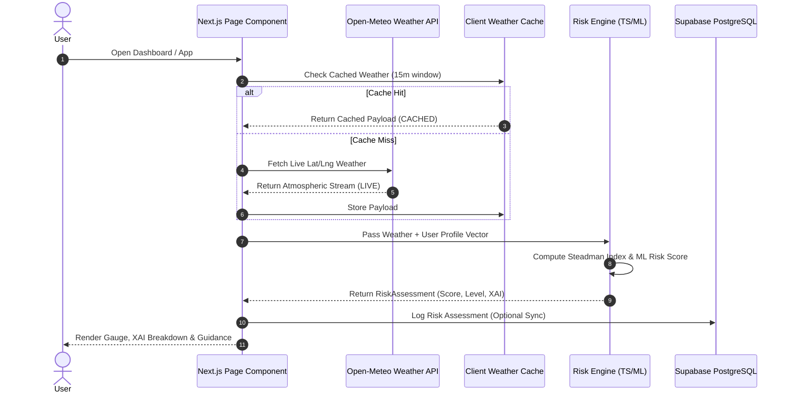
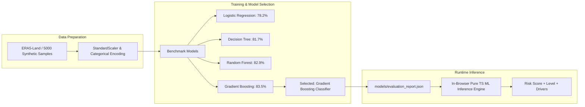
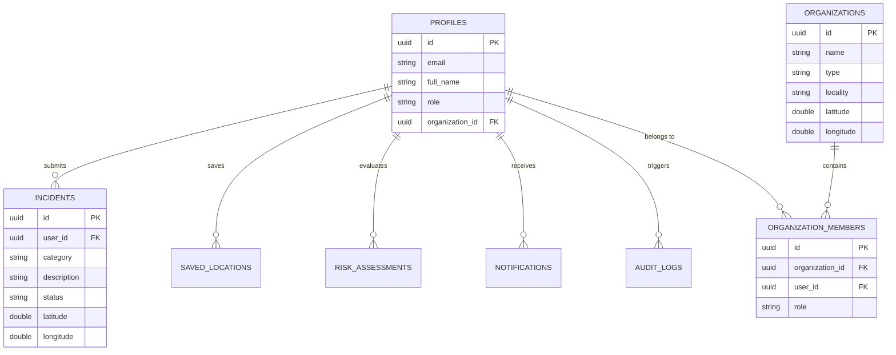
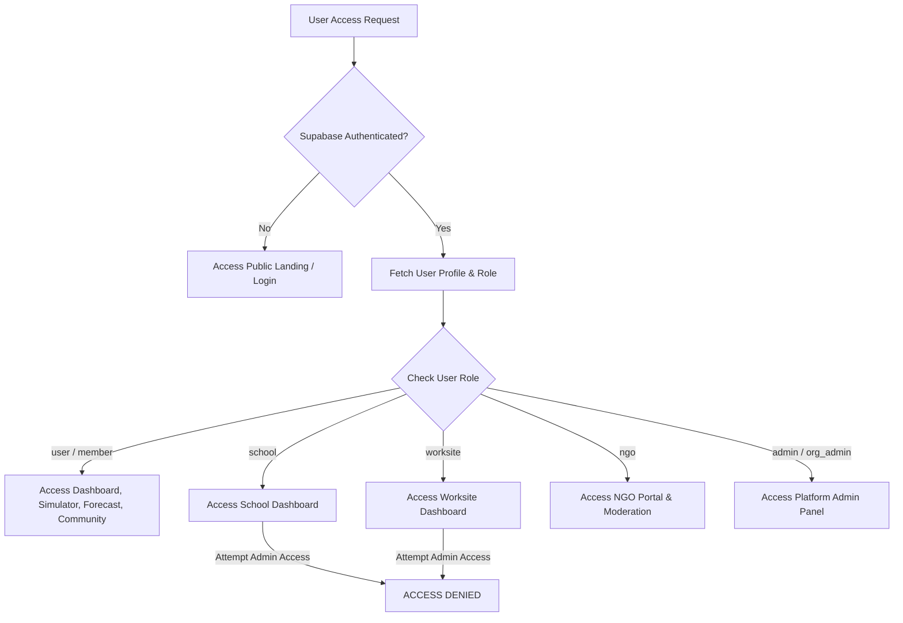
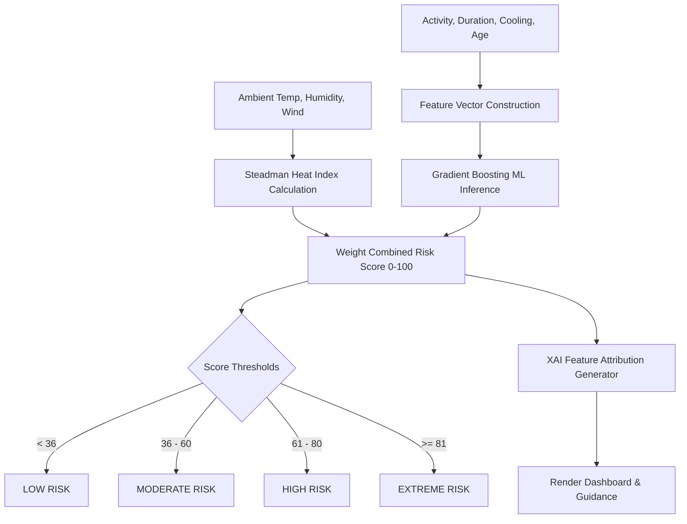
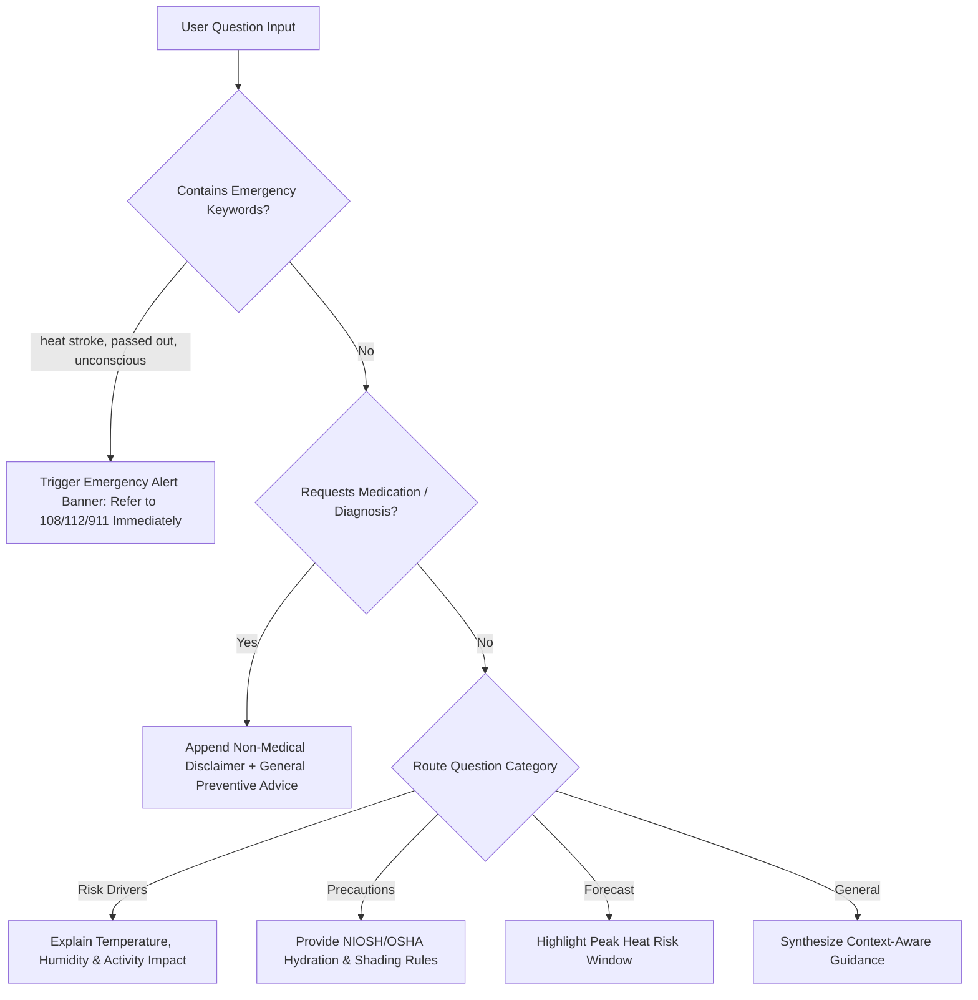
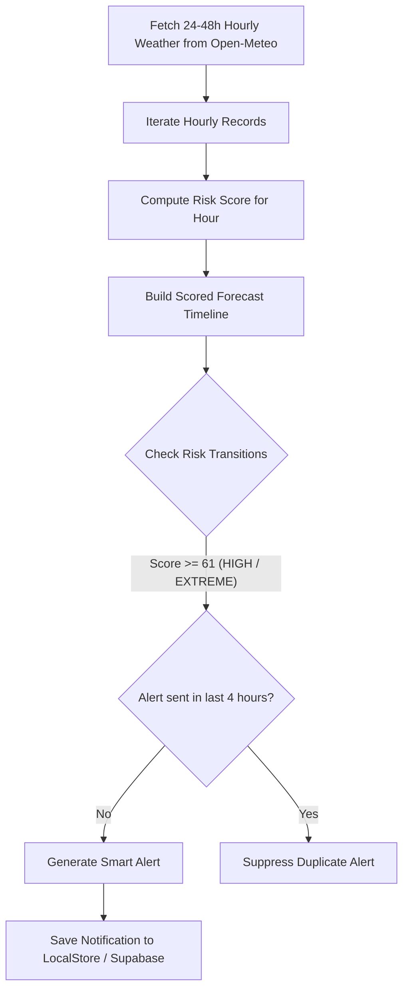
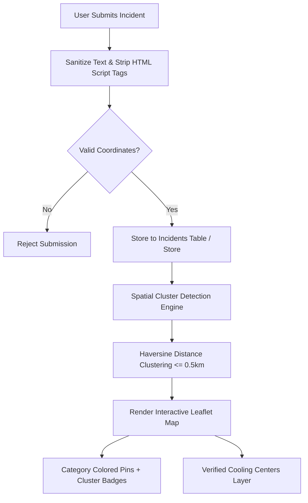
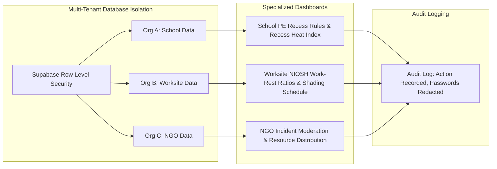

# HeatShield AI — System Architecture Diagrams

> Documentation-Ready Technical Diagrams representing the validated HeatShield AI application implementation.

---

## 1. Overall System Architecture

```mermaid
graph TD
    Client[Next.js 14 Frontend Layer] -->|REST / HTTPS| WeatherAPI[Open-Meteo Weather API]
    Client -->|Client ML Engine| MLInference[TS / Python Gradient Boosting ML]
    Client -->|HTTPS / WSS| Supabase[Supabase PostgreSQL Cloud]
    
    subgraph Frontend Services
        Client --> DashboardView[Personal Dashboard]
        Client --> SimView[Risk Simulator]
        Client --> AssistantView[AI Safety Assistant]
        Client --> MapView[Community Map & Reports]
        Client --> OrgViews[School / Worksite / NGO / Admin]
    end
    
    subgraph Database Layer (Supabase)
        Supabase --> Profiles[profiles Table]
        Supabase --> Incidents[incidents Table]
        Supabase --> Orgs[organizations & members]
        Supabase --> RLS[PostgreSQL Row Level Security]
    end
```

---

## 2. Data Flow Architecture



---

## 3. Machine Learning Pipeline Architecture



---

## 4. Database Entity-Relationship (ER) Structure



---

## 5. Authentication & Role-Based Access Control (RBAC) Flow



---

## 6. Real-Time Heat-Risk Pipeline



---

## 7. AI Safety Assistant Flow



---

## 8. Forecast & Smart Alert Pipeline Architecture



---

## 9. Community Map & Reporting Architecture



---

## 10. Organization Multi-Tenant Architecture


